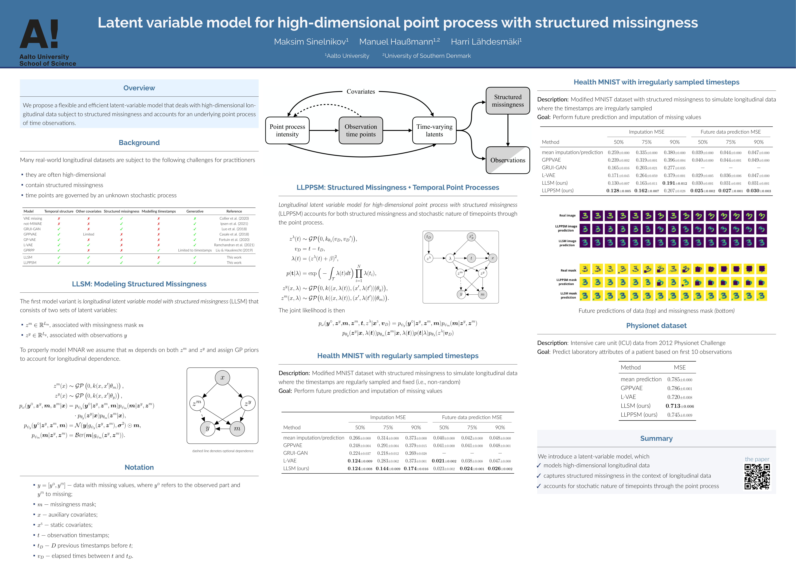

# Latent variable model for high-dimensional point process with structured missingness

This repository contains the python scripts for [our paper](https://proceedings.mlr.press/v235/sinelnikov24a.html) published in the Proceedings of The Forty-First International Conference on Machine Learning (ICML).

## Repository structure

The repository contains two main folders - LLSM and LLPPSM which contain implementation and experimental configs to the corresponding variants of our method. More information regarding these two method variants is in the manuscript.
## Poster

## Prerequisites

* Python
* PyTorch
* GPyTorch
* Torchvision
* Pandas
* Matplotlib

## Downloading MNIST digits

* Download and unzip archive from here: https://www.dropbox.com/s/j80vfwcqqu3vmnf/trainingSet.tar?dl=0

## Generating Health MNIST experiment data

* To create training/test data, labels as well as mask for LLSM, go to the corresponding folder and run: python Health_MNIST_generate.py --source=./trainingSet --destination=./data --num_3=10 --num_6=10 --missing=25 --data_file_name=data.csv --labels_file_name=labels.csv --mask_file_name=mask.csv --data_masked_file_name=masked_data.csv
* To create training/test data, labels as well as mask for LLPPSM, go to the corresponding folder and run: Health_MNIST_generate.py --source=./trainingSet --destination=./data --num_3=10 --num_6=10 --missing=25 --data_file_name=data.csv --labels_file_name=labels.csv --mask_file_name=mask.csv --data_masked_file_name=masked_data.csv --D=15
* See Health_MNIST_generate.py for configuration in both cases

## Training

* To run training for LLSM, go to the corresponding folder and run: python LVAE.py --f=./config/LLSM.txt
* To run training for LLPPSM, go to the corresponding folder and run: python LVAE.py --f=./config/LLPPSM.txt
* If you want to use a custom dataset, generate data and labels with accordance to .csv files in Health MNIST and modify config files

## Cite

Please cite this work as:

@InProceedings{pmlr-v235-sinelnikov24a,
  title = 	 {Latent variable model for high-dimensional point process with structured missingness},
  author =       {Sinelnikov, Maksim and Haussmann, Manuel and L\"{a}hdesm\"{a}ki, Harri},
  booktitle = 	 {Proceedings of the 41st International Conference on Machine Learning},
  pages = 	 {45525--45543},
  year = 	 {2024},
  editor = 	 {Salakhutdinov, Ruslan and Kolter, Zico and Heller, Katherine and Weller, Adrian and Oliver, Nuria and Scarlett, Jonathan and Berkenkamp, Felix},
  volume = 	 {235},
  series = 	 {Proceedings of Machine Learning Research},
  month = 	 {21--27 Jul},
  publisher =    {PMLR},
  pdf = 	 {https://raw.githubusercontent.com/mlresearch/v235/main/assets/sinelnikov24a/sinelnikov24a.pdf},
  url = 	 {https://proceedings.mlr.press/v235/sinelnikov24a.html}
}
